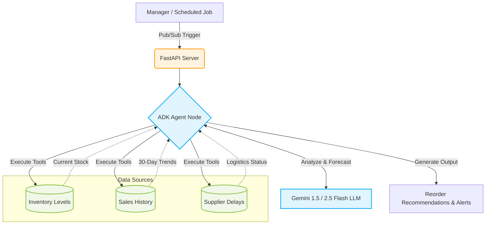

# 📦 Inventory Forecasting Agent

An intelligent, autonomous AI agent designed to help businesses reduce stockouts and excess inventory by analyzing historical sales data, forecasting demand, and recommending optimal reorder quantities.

This project is built using the **Google Agent Development Kit (ADK)** and powered by **Gemini Models**.

---

## 🌟 Key Features

| Feature | Description |
|---------|-------------|
| 📈 **Demand Forecasting** | Analyzes up to 30 days of historical sales data to identify trends and predict future demand accurately. |
| 🔄 **Reorder Recommendations** | Evaluates current inventory levels against historical trends to suggest data-driven optimal reorder quantities. |
| 🚚 **Supplier Delay Monitoring** | Takes potential supplier delays into account when generating reorder alerts, allowing for earlier ordering if necessary. |
| 🛡️ **Read-Only Safety** | The agent strictly provides recommendations and is explicitly restricted from autonomously placing live orders. |
| ⚡ **Dual Triggers** | Can be triggered interactively for ad-hoc queries, or deployed as a REST API (Pub/Sub) for scheduled, ambient alerts. |

---

## 🏗️ Architecture & Workflow

The following workflow diagram illustrates how the Inventory Forecasting Agent processes data to generate insights.



---

## ⚙️ Setup & Local Development

Follow these steps to run the agent locally.

### 1. Prerequisites
Ensure you have Python installed. The project relies on the following key dependencies:
- `google-adk`
- `fastapi`
- `python-dotenv`
- `uvicorn`

### 2. Configure Environment Variables
Create a `.env` file in the root of the project to securely store your Google AI Studio credentials:

```env
GOOGLE_GENAI_USE_VERTEXAI=False
GOOGLE_API_KEY="your-google-ai-studio-api-key"
MODEL="gemini-2.5-flash"
```
> [!NOTE] 
> If you are deploying this to production on Google Cloud, you can switch `GOOGLE_GENAI_USE_VERTEXAI=True` to utilize managed service accounts instead of an API key.

### 3. Run the FastAPI Server
Ensure you have your Python virtual environment activated, then start the application:

```bash
# Start the Uvicorn server locally
python app/fast_api_app.py
```

### 4. Trigger the Agent
With the server running on `http://localhost:8080`, you can send an HTTP POST request simulating a Pub/Sub event to activate the forecasting flow.

```bash
# Example cURL command to trigger the endpoint
curl -X POST http://localhost:8080/apps/app/trigger/pubsub \
  -H "Content-Type: application/json" \
  -d '{
        "message": {
          "data": "V2hhdCBzaG91bGQgSSByZW9yZGVyIHRvZGF5Pw==" 
        }
      }'
```
*(The `data` field above is base64 encoded for "What should I reorder today?")*

---

## 📊 Sample Output

When successfully triggered, the LLM will output a structured response analyzing the items, similar to this:

> **Inventory Alert: Widgets**
> - **Current Stock**: 20 units (Below reorder point of 50)
> - **Recent Sales**: Averaging 15 units/day over the last 30 days.
> - **Supplier Status**: Delayed by 3 days.
> - **Recommendation**: Order 200 units immediately to cover the delay and average lead time.
